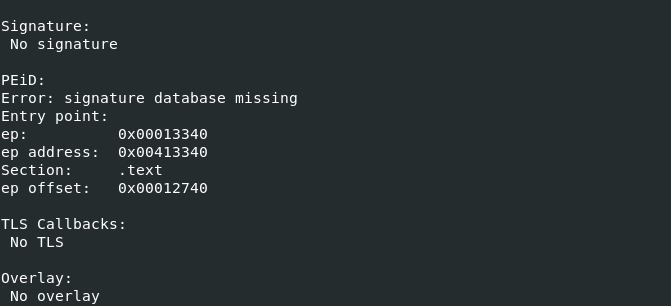

# Malware Analysis Report

The goal of this project is to analyse a windows info stealer malware sample SHA256 8370bc92f5cb661bd26f3bd5abb51f6d56c48acb438ae48aa3351044cd55678f, parse it with a custom python script, and write YARA rules to detect it and sign it.

#### 1.1. Static properties analysis

Here we'll try to gather as much information as possible without actually running the malware.

1. File: The file is a PE32 ie a 32-bit windows executable, as shown below.


This can also be verified by checking its signature { 5A 4D } from a hex dump against wikipedia's signatures list.

It has a size of 444k and uses C/C++ MS compiler.

2. Imports: The file imports 3 dll libraries: kernel32.dll, user32.dll and msimg.dll


Virus total provides a list of all the functions imported from these libraries. 

Kernel32.dll is suspicious because it is used to interact with the system. It is used to create processes, threads, files, and perform various other operations. msimg32.dll is used for image processing and user32.dll is used for user interface. This may help obfuscate the malware's operations or to interact with the user.

3. Encryption: From virustotal, the malware decrypts data using TEA (verified using signsrch as shown below) and taps into the system firmware by setting a UEFI variable. It also creates guard pages, often used to prevent reverse engineering and debugging.

   
4. Behavior: From virustotal, the malware opens files in sensitive directories such as 
   - C:\Users\admin,
   - C:\ProgramData\Microsoft\Windows Defender\Platform\
   - C:\WINDOWS\system32, 
   - C:\Windows\Microsoft.NET\Framework\
  
The info stealer also requires SE_DEBUG_PRIVILEGE needed to debug and adjust the memory of a process owned by another account.

5. it can also capture key strokes by creating a DirectInput object and may check if it is running in a virtual environment.
   
6. C&C and Network: its C2 URLs / IPs  are found in malware configuration. The file establishes communications with a few IP addresses : 
   - 185.215.113.29:20819 (TCP)
   - 20.99.133.109:443 (TCP)  --> https 
   - 23.216.147.64:443 (TCP)  --> https


#### 1.2 Uncommon properties of PE sample:
- pecheck shows a high level of entropy especially in the data section: 7.96/8 (*see below with pecheck*)


 - with the same command, we can also see that the executable isn't even signed


- we can see the strings are also jammed, indicating some level of obfuscation


## 2. Yara rules and similar samples:


#### 2.1 similar samples based on strings
Simply checking for 3 imports : kernel32.dll, user32.dll and msimg32.dll yields a total of **24** similar samples. 

adding one of the pdb strings:      
```
"C:\\kipos\\xidabuwese_mimayug\\gilozujexe\\64\\kota_58-ko.pdb"
```
can uniquely identify the sample in question.

#### 2.2 rich header and similar samples
```
import "pe"
import "console"
import "hash"
rule rich_head
{
	meta:
		description = "sign rich header - see ntcore.com for doc"
	condition:
		console.log(hash.md5(pe.rich_signature.clear_data))
}
```
This rule can be used to determine the rich header of the sample in hex, which is later used in sim_rich_header.yara to find **10** samples with the same rich header.
```
import "pe"
import "console"
import "hash"
rule rich_head
{
	meta:
		description = "sign rich header - see ntcore.com for doc"
	condition:
		hash.md5(pe.rich_signature.clear_data) == "e7762e74d60e4118cfeaee1aa62806e8"
}
```